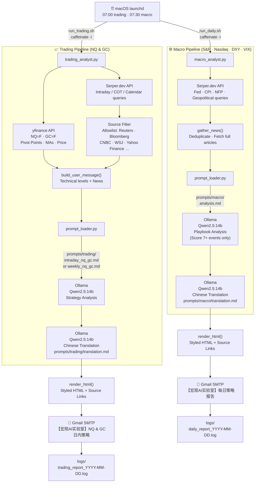

# 🏦 Macro AI Lab: Automated Strategy Analyst

A localized, autonomous system designed to transform fragmented financial news into structured market intelligence. This project algorithmizes the **"News-to-Market Playbook"** using local LLM inference on macOS (M1 Pro).

---

## 🎯 Project Goal
To build a "Zero-Cost, Privacy-First" pipeline that:
1.  **Filters Noise:** Identifies high-impact macro drivers (Score 7+).
2.  **Deduces Logic:** Maps events through Primary, Secondary, and Terminal impact layers.
3.  **Automates Delivery:** Sends a professional briefing to the user's inbox every morning.

---

## 🛠 Tech Stack
* **Inference Engine:** [Ollama](https://ollama.com/) running **Qwen 2.5 7B/14B**.
* **Data Sourcing:** [Serper.dev API](https://serper.dev/) (Google Search for Bloomberg/Reuters).
* **Orchestration:** Python 3.11+.
* **Infrastructure:** MacBook Pro M1 Pro (16GB Unified Memory).
* **Scheduling:** macOS `launchd` for automated 07:30 AM execution.

---

## 🔄 End-to-End Workflow

Two parallel pipelines run each morning, both sharing the same infrastructure.



---

## 🚀 How to Run

All scripts are run from the `scripts/` directory with Python 3.11+. Ollama must be running locally before executing any report.

```bash
# Start Ollama (if not already running)
ollama serve
```

---

### `macro_analyst.py` — Daily Macro Report

| Command | Behavior |
|:--------|:---------|
| `python3 macro_analyst.py` | Full run — 7 Serper queries, Ollama analysis + Chinese translation, sends email |
| `python3 macro_analyst.py --test` | Fast smoke-test — 1 query only, skips Ollama entirely, sends `[TEST]` email to verify SMTP |

**Flag reference:**

| Flag | Type | Default | Description |
|:-----|:-----|:--------|:------------|
| `--test` | boolean | off | Limits to 1 search query, skips inference, marks email subject with `[TEST]` |

---

### `trading_analyst.py` — NQ & GC Trading Report

| Command | Behavior |
|:--------|:---------|
| `python3 trading_analyst.py` | Intraday report — fetches NQ/GC technical levels + news, full Ollama run |
| `python3 trading_analyst.py --mode weekly` | Weekly report — adds COT + economic calendar queries, uses `weekly_nq_gc.md` prompt |
| `python3 trading_analyst.py --test` | Intraday smoke-test — 1 query, skips Ollama, sends `[TEST]` email |
| `python3 trading_analyst.py --mode weekly --test` | Weekly smoke-test |

**Flag reference:**

| Flag | Values | Default | Description |
|:-----|:-------|:--------|:------------|
| `--mode` | `intraday` \| `weekly` | `intraday` | Selects prompt and query set. `weekly` adds COT/calendar queries and uses `weekly_nq_gc.md` |
| `--test` | boolean | off | 1 search query, skips Ollama inference, prepends `[TEST]` to email subject |

**Mode differences (`intraday` vs `weekly`):**

| | `intraday` | `weekly` |
|:--|:-----------|:---------|
| Prompt file | `prompts/trading/intraday_nq_gc.md` | `prompts/trading/weekly_nq_gc.md` |
| Extra queries | — | CFTC COT (gold + NQ), investing.com economic calendar |
| yfinance news | Fetched | Fetched |
| Email subject | `NQ & GC 日内策略` | `NQ & GC 周度策略报告` |

---

### Shell wrappers (used by `launchd`)

| Script | Schedule | Behavior |
|:-------|:---------|:---------|
| `run_trading.sh` | 07:00 AM daily | Auto-selects `--mode weekly` on Mondays, `--mode intraday` all other days. Logs to `logs/trading_report_YYYY-MM-DD.log` |
| `run_daily.sh` | 07:30 AM daily | Always runs macro report (no flags). Logs to `logs/daily_report_YYYY-MM-DD.log` |

Both scripts use `caffeinate -i` to prevent the Mac from sleeping during execution.

---

### Environment variables (`.env`)

Required before any run:

```
SERPER_API_KEY=        # Serper.dev API key
SMTP_HOST=             # e.g. smtp.gmail.com
SMTP_PORT=587          # default
SMTP_USER=             # sender Gmail address
SMTP_PASSWORD=         # Gmail App Password
REPORT_RECIPIENT=      # destination email
```

Optional overrides:

```
OLLAMA_HOST=http://localhost:11434   # default
OLLAMA_MODEL=qwen2.5:14b             # default
```

---

## 📂 Directory Structure
```text
Macro_AI_Lab/
├── prompts/
│   ├── macro/              # analysis.md · translation.md
│   └── trading/            # intraday_nq_gc.md · weekly_nq_gc.md · translation.md
├── scripts/
│   ├── macro_analyst.py    # Daily macro report
│   ├── trading_analyst.py  # NQ & GC intraday / weekly report
│   ├── prompt_loader.py    # Loads prompts from .md files at runtime
│   ├── run_daily.sh        # launchd wrapper for macro report
│   └── run_trading.sh      # launchd wrapper for trading report
├── playbook/               # News-to-Market methodology
├── config/                 # Ollama Modelfiles
├── logs/                   # Dated execution logs
└── .env                    # API keys · SMTP credentials (never committed)