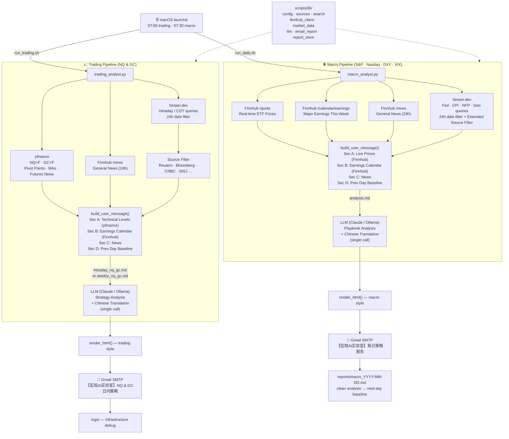

# 🏦 Macro AI Lab: Automated Strategy Analyst

A localized, autonomous system that transforms fragmented financial news into structured market intelligence. This project algorithmizes the **"News-to-Market Playbook"** — filtering macro noise, tracing transmission paths, and delivering a professional bilingual briefing to your inbox every morning.

---

## 🎯 Project Goal
A "Zero-Cost, Privacy-First" pipeline that:
1. **Filters Noise:** Identifies high-impact macro drivers (Score 7+) and drops the rest.
2. **Deduces Logic:** Maps events through Primary, Secondary, and Terminal impact layers.
3. **Automates Delivery:** Sends a styled bilingual (English + 简体中文) HTML email each morning.

---

## 🛠 Tech Stack

| Layer | Tool |
|:------|:-----|
| **LLM (primary)** | [Claude API](https://anthropic.com/) — claude-opus-4-6 with extended thinking |
| **LLM (local fallback)** | [Ollama](https://ollama.com/) — Qwen 2.5 14B |
| **News search** | [Serper.dev API](https://serper.dev/) — Google News with date filtering |
| **Financial data** | [Finnhub API](https://finnhub.io/) — real-time prices, earnings calendar, news feed |
| **Futures technicals** | [yfinance](https://github.com/ranaroussi/yfinance) — NQ & GC OHLCV history, pivot points, MAs |
| **Article extraction** | [trafilatura](https://trafilatura.readthedocs.io/) — clean body text (no regex scraping) |
| **Orchestration** | Python 3.11+ |
| **Scheduling** | macOS `launchd` — 07:00 trading · 07:30 macro |

---

## 📡 Finnhub API — What We Use

Finnhub is used on the **free tier** (60 calls/min). Below is a precise accounting of what the free tier provides and exactly how this project uses it.

### Free tier endpoints used

| Endpoint | What it returns | Used by |
|:---------|:----------------|:--------|
| `GET /quote` | Real-time price, change, day high/low for stocks & ETFs | `macro_analyst.py` — Section A live prices |
| `GET /news?category=general` | Up to 100 recent market news headlines with snippets | Both pipelines — seeds the news pool before Serper queries |
| `GET /calendar/earnings` | Weekly earnings schedule with EPS & revenue estimates | `macro_analyst.py` — Section B earnings calendar |

### Endpoint tried but not available on free tier

| Endpoint | Status | Notes |
|:---------|:-------|:------|
| `GET /calendar/economic` | ❌ 403 Forbidden | Returns CPI, NFP, FOMC dates with actual vs. consensus — **paid plan only** |

### How each endpoint feeds the LLM

**`/quote` — real-time ETF proxies for macro instruments**

Instead of using delayed/cached data, the macro pipeline fetches live prices via Finnhub and injects them as **Section A** of the LLM prompt. The LLM uses these to ground the Inter-market Signals table with actual levels rather than inferring from news headlines.

| Target instrument | ETF proxy used |
|:------------------|:---------------|
| S&P 500 | SPY |
| Nasdaq 100 | QQQ |
| VIX (Volatility Index) | VIXY |
| 20-Year Treasury Bond | TLT |
| High Yield Credit | HYG |
| US Dollar (DXY) | UUP |
| Gold | GLD |
| WTI Crude Oil | USO |

**`/news?category=general` — pre-filtered news seed**

Finnhub's news feed returns 100 pre-categorized financial headlines, which seeds the news pool *before* Serper queries run. Items are filtered to the last 24 hours (using the `datetime` Unix timestamp field) and then merged with Serper results using URL deduplication.

**`/calendar/earnings` — weekly major earnings**

Fetches the current week's (Mon–Sun) earnings schedule and filters down to ~35 macro-relevant tickers (mega-cap tech, big banks, energy majors, bellwethers). Injected as **Section B** so the LLM can flag upcoming earnings as 5–6 score events and reference EPS/revenue estimates in its analysis.

### yfinance vs. Finnhub — why both are needed

| Task | Tool | Reason |
|:-----|:-----|:-------|
| Macro instrument spot prices (SPY, QQQ, GLD…) | **Finnhub** `/quote` | Real-time, reliable for liquid ETFs |
| NQ & GC futures OHLCV + pivot points | **yfinance** | Finnhub free tier does not cover futures tickers (`NQ=F`, `GC=F`); 6-month daily history needed for pivot/MA calculation |
| Ticker-specific futures news | **yfinance** `.news` | Finnhub general news is not futures-tagged |

---

## 🔄 End-to-End Workflow

Two parallel pipelines run each morning, both drawing from a shared `lib/` layer.



---

## 🚀 How to Run

All scripts are run from the `scripts/` directory with Python 3.11+.

```bash
# If using Ollama as the LLM engine:
ollama serve
```

---

### `macro_analyst.py` — Daily Macro Report

| Command | Behavior |
|:--------|:---------|
| `python3 macro_analyst.py` | Full run — Finnhub prices + earnings + Serper news + LLM + email |
| `python3 macro_analyst.py --test` | Smoke-test — 1 query, skips LLM, sends `[TEST]` email to verify SMTP |

---

### `trading_analyst.py` — NQ & GC Trading Report

| Command | Behavior |
|:--------|:---------|
| `python3 trading_analyst.py` | Intraday report — yfinance levels + Finnhub news + Serper + full LLM run |
| `python3 trading_analyst.py --mode weekly` | Weekly report — adds COT queries, uses `weekly_nq_gc.md` prompt |
| `python3 trading_analyst.py --test` | Smoke-test — 1 query, skips LLM, sends `[TEST]` email |
| `python3 trading_analyst.py --mode weekly --test` | Weekly smoke-test |

**Mode differences (`intraday` vs `weekly`):**

| | `intraday` | `weekly` |
|:--|:-----------|:---------|
| Prompt | `intraday_nq_gc.md` | `weekly_nq_gc.md` |
| Extra queries | — | CFTC COT (gold + NQ), investing.com calendar |
| Email subject | `NQ & GC 日内策略` | `NQ & GC 周度策略报告` |

---

### `fetch_news.py` — CLI News Fetcher

```bash
python3 fetch_news.py "Fed rate decision" --num 5
python3 fetch_news.py "CPI inflation" --date 2026-04-01
python3 fetch_news.py "S&P 500" --start 2026-03-01 --end 2026-03-31 --json
```

---

### Shell wrappers (used by `launchd`)

| Script | Schedule | Behavior |
|:-------|:---------|:---------|
| `run_trading.sh` | 07:00 AM daily | Auto-selects `--mode weekly` on Mondays, `intraday` all other days. Logs to `logs/` |
| `run_daily.sh` | 07:30 AM daily | Always runs macro report. Logs to `logs/` |

Both scripts use `caffeinate -i` to prevent the Mac from sleeping during execution.

---

### Environment variables (`.env`)

**Required:**
```
SERPER_API_KEY=        # serper.dev API key
SMTP_HOST=             # e.g. smtp.gmail.com
SMTP_PORT=587
SMTP_USER=             # sender Gmail address
SMTP_PASSWORD=         # Gmail App Password
REPORT_RECIPIENT=      # destination email
```

**LLM selection:**
```
LLM_ENGINE=claude      # "claude" (default) or "ollama"
ANTHROPIC_API_KEY=     # required when LLM_ENGINE=claude
CLAUDE_MODEL=claude-opus-4-6
```

**Optional / fallback:**
```
OLLAMA_HOST=http://localhost:11434
OLLAMA_MODEL=qwen2.5:14b
FINNHUB_API_KEY=       # free tier at finnhub.io/register
```

> Without `FINNHUB_API_KEY`, live prices and earnings calendar show "unavailable" and Finnhub news is skipped. All Serper-based news gathering works normally.

---

## 📂 Directory Structure

```text
Macro_AI_Lab/
├── prompts/
│   ├── macro/
│   │   └── analysis.md          # Noise filter → Playbook analysis → Chinese translation (single prompt)
│   └── trading/
│       ├── intraday_nq_gc.md    # Intraday NQ/GC setups → Chinese translation (single prompt)
│       └── weekly_nq_gc.md      # Weekly NQ/GC strategy → Chinese translation (single prompt)
├── scripts/
│   ├── lib/                     # Shared library (imported by all pipelines)
│   │   ├── config.py            # All env-var loading
│   │   ├── sources.py           # TRUSTED_SOURCES + MACRO_TRUSTED_SOURCES allowlists
│   │   ├── search.py            # serper_search, fetch_article_text (trafilatura), build_tbs
│   │   ├── finnhub_client.py    # Earnings calendar + general news (free tier)
│   │   ├── market_data.py       # Real-time ETF prices via Finnhub /quote
│   │   ├── llm.py               # run_claude / run_ollama / run_llm
│   │   ├── email_report.py      # render_html, send_email, build_sources_md
│   │   ├── report_store.py      # Save/load clean analysis to reports/ for day-over-day baseline
│   │   └── prompt_loader.py     # Loads prompts from .md files at runtime
│   ├── macro_analyst.py         # Daily macro report entry point
│   ├── trading_analyst.py       # NQ & GC trading report entry point
│   ├── fetch_news.py            # CLI news fetcher (debugging tool)
│   ├── run_daily.sh             # launchd wrapper — macro report
│   └── run_trading.sh           # launchd wrapper — trading report
├── reports/                     # Clean daily analysis saved as .md (used as next-day LLM baseline)
├── playbook/                    # News-to-Market methodology docs
├── config/                      # Ollama Modelfiles
├── logs/                        # Infrastructure / debug logs only
└── .env                         # API keys · SMTP credentials (never committed)
```
