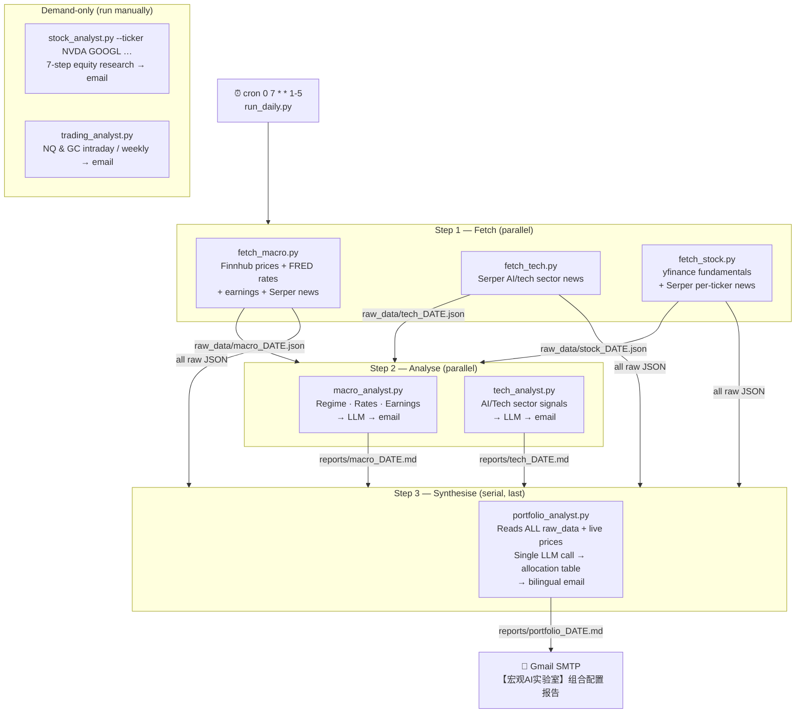

# 🏦 Macro AI Lab: Automated Strategy Analyst

An autonomous pipeline that fetches raw financial data, runs structured LLM analysis, and delivers a professional bilingual (English + 简体中文) portfolio allocation report to your inbox every morning.

---

## 🎯 Project Goal

A "Zero-Cost, Privacy-First" pipeline that:
1. **Fetches raw data:** Macro prices/rates/news, AI/tech sector news, and individual stock fundamentals/technicals — all in parallel.
2. **Runs structured analysis:** Macro and tech analysts produce specialist reports; the Portfolio Analyst synthesises everything into a single actionable allocation.
3. **Eliminates LLM-to-LLM decay:** The Portfolio Analyst reads raw data directly — no information is lost through intermediate summaries.
4. **Automates delivery:** Styled bilingual HTML email each morning; raw reports saved as Markdown for day-over-day baseline continuity.

---

## 🛠 Tech Stack

| Layer | Tool |
|:------|:-----|
| **LLM** | [Claude API](https://anthropic.com/) — `claude-opus-4-6` |
| **LLM (local fallback)** | [Ollama](https://ollama.com/) — Qwen 2.5 14B |
| **News search** | [Serper.dev API](https://serper.dev/) — Google News with date filtering |
| **Financial data** | [Finnhub API](https://finnhub.io/) — real-time prices, earnings calendar |
| **Market data** | [yfinance](https://github.com/ranaroussi/yfinance) — OHLCV history, fundamentals, news |
| **Macro rates** | [FRED](https://fred.stlouisfed.org/) public API — yield curve, Fed Funds rate (no key required) |
| **Technical indicators** | [stockstats](https://github.com/jealous/stockstats) — RSI, ATR, MACD, Bollinger Bands |
| **Article extraction** | [trafilatura](https://trafilatura.readthedocs.io/) — clean body text |
| **Orchestration** | `run_daily.py` — Python 3.11+ threading, subprocess |
| **Scheduling** | macOS `cron` — `0 7 * * 1-5` (weekdays at 7:30 AM) |

---

## 🔄 Architecture

The pipeline has two layers: **fetchers** that save raw JSON, and **analysts** that read JSON and call the LLM. This separation means any analyst can be rerun independently without re-fetching data.



### Why the Portfolio Analyst is separate

Every other analyst produces an intermediate summary. The Portfolio Analyst bypasses those summaries and reads **raw data directly** — prices, rates, earnings, and unfiltered news articles — in a single LLM call. This eliminates the information decay that happens when one LLM summarises for another.

---

## 🚀 How to Run

All scripts run from the `scripts/` directory with Python 3.11+.

### Daily orchestrator (normal use)

```bash
cd scripts/
python3 run_daily.py          # full run: fetch → analyse → portfolio
python3 run_daily.py --test   # skip all LLM calls, verify pipeline wiring
```

**Pipeline steps:**
1. `fetch_macro` + `fetch_tech` + `fetch_stock` — parallel
2. `macro_analyst` + `tech_analyst` — parallel (each reads its own raw JSON)
3. `portfolio_analyst` — serial, runs last (reads all raw JSON + live prices)

---

### Individual scripts

| Script | Command | Notes |
|:-------|:--------|:------|
| **Portfolio analyst** | `python3 analyst/portfolio_analyst.py` | Requires today's raw JSON from fetchers |
| **Macro analyst** | `python3 analyst/macro_analyst.py` | Requires `raw_data/macro_DATE.json` |
| **Tech analyst** | `python3 analyst/tech_analyst.py` | Requires `raw_data/tech_DATE.json` |
| **Stock analyst** | `python3 analyst/stock_analyst.py --ticker NVDA GOOGL MSFT TSM META AMD AMZN` | Demand-only, not in daily pipeline |
| **Trading analyst** | `python3 trading_analyst.py` | Separate pipeline — NQ & GC intraday |
| **Trading (weekly)** | `python3 trading_analyst.py --mode weekly` | Adds COT queries |

All scripts accept `--test` to skip the LLM call and send a `[TEST]` email to verify wiring.

---

### Portfolio configuration (`config/watchlist.yaml`)

The watchlist drives the entire portfolio pipeline. Each stock entry defines:

```yaml
core:
  - ticker: NVDA
    name: NVIDIA Corporation
    layer: AI Infrastructure
    thesis: >
      Dominant GPU platform for AI training and inference...
    key_risks:
      - AMD/Intel competitive pressure on data center GPU share
    upgrade_condition: N/A  # already core

watchlist:
  - ticker: META
    name: Meta Platforms
    layer: AI Application
    thesis: >
      Monetising AI through Llama open-source ecosystem...
    upgrade_condition: Llama 4 adoption exceeds internal projections
```

- **`core`** — fully deployed positions, held on thesis until a thesis-killer event
- **`watchlist`** — monitored for a catalyst; the Portfolio Analyst evaluates upgrade conditions daily

The `portfolio_analyst` and `fetch_stock` both read from `watchlist.yaml` automatically.

---

## 📡 Data Sources

### Finnhub (free tier, 60 calls/min)

| Endpoint | Used by | What it returns |
|:---------|:--------|:----------------|
| `GET /quote` | `fetch_macro` | Real-time ETF spot prices (VOO, QQQ, GLD, TLT, VIXY, HYG, UUP, USO) |
| `GET /news?category=general` | `fetch_macro` | Up to 100 recent market headlines |
| `GET /calendar/earnings` | `fetch_macro` | Weekly earnings schedule with EPS/revenue estimates |

> `/calendar/economic` (CPI, NFP, FOMC dates) returns 403 on the free tier.

### FRED (no API key required)

| Series | Used by | What it returns |
|:-------|:--------|:----------------|
| DGS2, DGS10, DGS30, FEDFUNDS | `fetch_macro` | 2Y/10Y/30Y Treasury yields + Fed Funds rate |

### yfinance

| Used by | What it fetches |
|:--------|:----------------|
| `fetch_stock` | 1Y daily OHLCV, P/E, EPS, revenue, margins, RSI, ATR, MACD, Bollinger Bands |
| `portfolio_analyst` | Live prices + RSI/ATR/MA50/MA200/52w high for all portfolio tickers |
| `trading_analyst` | NQ=F & GC=F OHLCV, pivot points, MAs |

### Serper.dev (Google News, free tier ~2500 searches/month)

| Used by | Queries |
|:--------|:--------|
| `fetch_macro` | Fed, CPI, NFP, geopolitical macro queries (24h filter) |
| `fetch_tech` | AI sector, GPU, cloud infrastructure queries (24h filter) |
| `fetch_stock` | Per-ticker news queries (7-day filter) |
| `trading_analyst` | Intraday / COT queries |

---

## 📂 Directory Structure

```text
Macro_AI_Lab/
├── config/
│   └── watchlist.yaml           # Portfolio mandate: tickers, thesis, risks, upgrade conditions
├── prompts/
│   ├── macro/
│   │   └── analysis.md          # Macro regime analysis → Chinese translation
│   ├── tech/
│   │   └── analysis.md          # AI/tech sector signals → Chinese translation
│   ├── portfolio/
│   │   └── allocation.md        # CIO allocation prompt (IPS + 7-step structure)
│   ├── stock/
│   │   └── analysis.md          # 7-step equity research → Chinese translation
│   └── trading/
│       ├── intraday_nq_gc.md    # NQ & GC intraday setups
│       └── weekly_nq_gc.md      # NQ & GC weekly strategy
├── raw_data/                    # Intermediate JSON: written by fetchers, read by analysts
│   └── <prefix>_YYYY-MM-DD.json
├── reports/                     # Clean LLM output saved as Markdown — next-day baseline
│   └── <prefix>_YYYY-MM-DD.md
├── scripts/
│   ├── data_fetcher/            # Step 1: fetch raw data, save to raw_data/
│   │   ├── fetch_macro.py       # Finnhub prices + FRED rates + earnings + Serper macro news
│   │   ├── fetch_tech.py        # Serper AI/tech sector news
│   │   └── fetch_stock.py       # yfinance fundamentals/technicals + Serper per-ticker news
│   ├── analyst/                 # Steps 2–3: read raw_data/, call LLM, email report
│   │   ├── macro_analyst.py     # Macro regime report
│   │   ├── tech_analyst.py      # AI/tech sector report
│   │   ├── portfolio_analyst.py # Portfolio allocation (reads ALL raw data, single LLM call)
│   │   └── stock_analyst.py     # Individual stock research (demand-only)
│   ├── lib/                     # Shared library
│   │   ├── config.py            # All env-var loading
│   │   ├── sources.py           # TRUSTED_SOURCES allowlists
│   │   ├── search.py            # serper_search, fetch_article_text (trafilatura)
│   │   ├── finnhub_client.py    # Earnings calendar + general news
│   │   ├── market_data.py       # Real-time ETF prices via Finnhub /quote
│   │   ├── rates_data.py        # FRED yield curve + Fed Funds rate
│   │   ├── stock_data.py        # yfinance + stockstats fundamentals/technicals
│   │   ├── raw_store.py         # Save/load raw JSON between fetchers and analysts
│   │   ├── report_store.py      # Save/load LLM reports for day-over-day baseline
│   │   ├── watchlist.py         # Load and query config/watchlist.yaml
│   │   ├── llm.py               # run_claude / run_ollama / run_llm
│   │   ├── email_report.py      # render_html (macro/stock styles), send_email
│   │   └── prompt_loader.py     # Load prompts from .md files at runtime
│   ├── run_daily.py             # Orchestrator: 3-step pipeline with parallel execution
│   ├── trading_analyst.py       # NQ & GC trading report (separate pipeline)
│   ├── resend_trading_report.py # One-off: retranslate existing report and resend
│   └── fetch_news.py            # CLI news fetcher (debugging tool)
├── logs/                        # Infrastructure / debug logs
└── .env                         # API keys · SMTP credentials (never committed)
```

---

## ⚙️ Environment Variables (`.env`)

**Required:**
```
SERPER_API_KEY=        # serper.dev API key
SMTP_HOST=             # e.g. smtp.gmail.com
SMTP_PORT=587
SMTP_USER=             # sender Gmail address
SMTP_PASSWORD=         # Gmail App Password
REPORT_RECIPIENT=      # destination email address
```

**LLM selection:**
```
LLM_ENGINE=claude      # "claude" (default) or "ollama"
ANTHROPIC_API_KEY=     # required when LLM_ENGINE=claude
CLAUDE_MODEL=claude-opus-4-6
```

**Optional:**
```
OLLAMA_HOST=http://localhost:11434
OLLAMA_MODEL=qwen2.5:14b
FINNHUB_API_KEY=       # free tier at finnhub.io/register
```

> Without `FINNHUB_API_KEY`, live prices and earnings calendar show "unavailable" and Finnhub news is skipped. All Serper and FRED data gathering works normally.

---

## 📅 Scheduling (macOS cron)

```bash
# Edit crontab
crontab -e

# Run daily pipeline at 7:30 AM, weekdays only
30 7 * * 1-5 cd /path/to/Macro_AI_Lab/scripts && python3 run_daily.py >> ../logs/daily.log 2>&1
```

The `trading_analyst` is not included in the daily cron — run it manually or add a separate cron entry.
